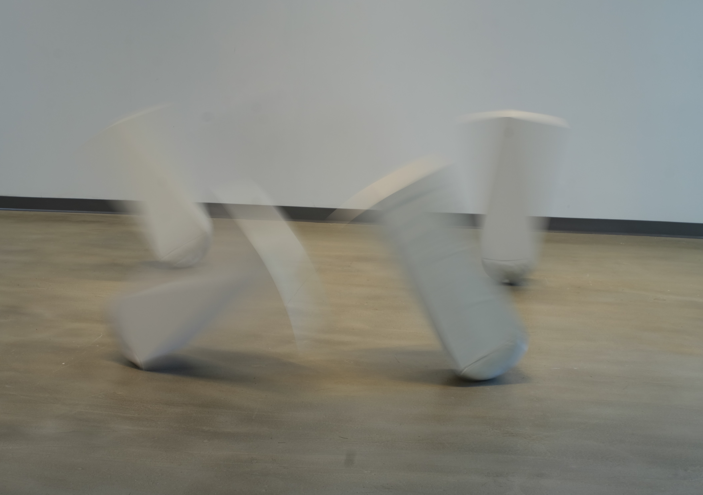
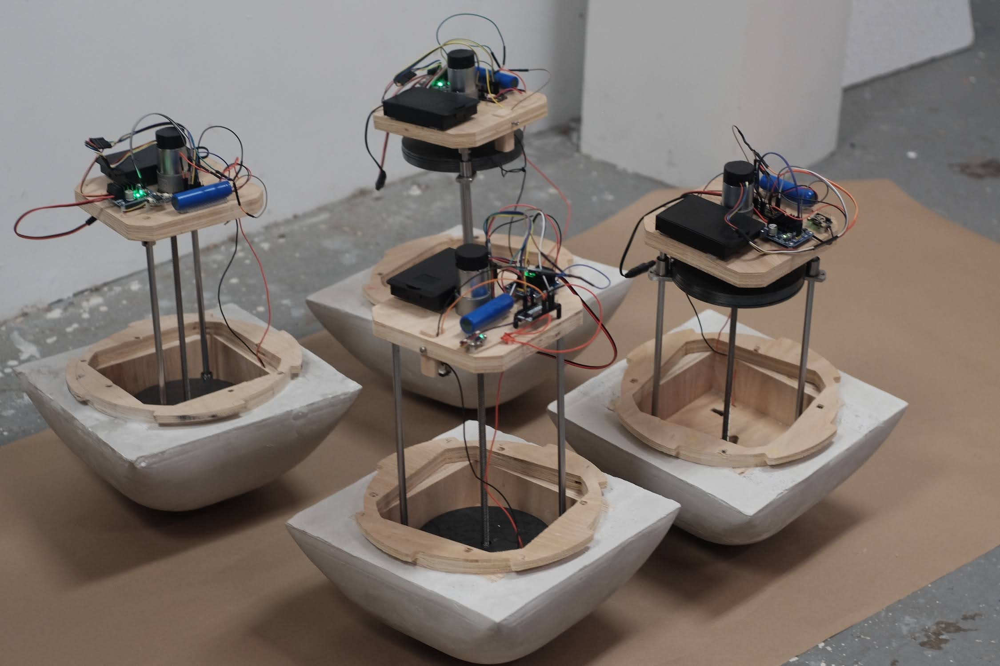

## Hubris: my University of Georgia MFA in Studio Art thesis project

This directory contains the ESP32-S3 code in C++ that runs this kinetic sculpture of motorized pedestals, as well as the written paper that accompanied this project.

_The video sound is good :) Turn up the volume!_

https://github.com/user-attachments/assets/4496093b-284b-4d7e-bc05-8807264797bd

